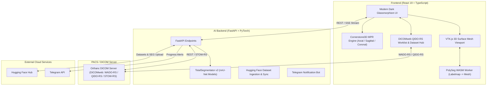

# 🧬 CS3D Viewer — 3D DICOM & AI Segmentation Workspace

[](https://react.dev/)
[](https://www.typescriptlang.org/)
[](https://www.cornerstonejs.org/)
[](https://kitware.github.io/vtk-js/)
[](https://github.com/wasserth/TotalSegmentator)
[](https://fastapi.tiangolo.com/)
[](https://www.orthanc-server.com/)
[](LICENSE)

A state-of-the-art, web-based medical imaging workspace for DICOM visualization and deep learning segmentation analysis. Built with **Cornerstone3D**, **VTK.js**, and **TotalSegmentator v2**, CS3D Viewer provides synchronized Multi-Planar Reconstruction (MPR), GPU/WASM-accelerated 3D surface mesh generation, automated clinical AI segmentations, and DICOMweb PACS connectivity via **Orthanc**.

---

## 🌟 Highlights & Key Features

### 🖥️ Cornerstone3D Multi-Planar Reconstruction (MPR)
- **Synchronized Orthogonal Viewports**: High-performance Axial, Sagittal, and Coronal reconstructions.
- **Clinical Tools**: Crosshairs, zoom, pan, synchronized slice scrolling, and VOI / Window-Level adjustments.
- **Window/Level Presets**: One-click CT presets (Soft Tissue / Abdomen, Bone, Lung, Brain, Mediastinum, Angio) with live HUD telemetry (WW/WC, slice index, zoom level, slice thickness).

### 🧊 Interactive 3D Surface Rendering & WASM Mesh Engine
- **VTK.js 3D Viewport**: Real-time rendering of full 3D anatomical structures with camera orbit, pan, zoom, and orientation gizmo.
- **WASM Acceleration**: Powered by `@icr/polyseg-wasm` running in dedicated Web Workers for instant client-side conversion of DICOM SEG labelmaps to 3D surface meshes.
- **STL Export**: Export any segmented organ or pathological structure to a 3D-printable `.stl` file with real-world millimeter coordinates.

### 🧠 TotalSegmentator v2 AI Hub
- **45+ Automated Deep Learning Tasks**: Whole Body (117 anatomical structures), Abdominal Organs & Vessels, Spine & Vertebrae, Cardiac Chambers & Coronary Arteries, Pulmonary Vessels, Head, Brain & Dental Arch (77 teeth classes), Pathology/Emergency detection, and specialized MRI models.
- **Intelligent Recommendation Engine**: Automatically suggests relevant AI segmentation tasks based on DICOM series metadata (modality, body part examined, contrast agent, slice count).
- **Fast / High-Res Modes**: Fast 3mm inference for rapid previews or full-resolution inference for fine anatomical detail.
- **Compliance**: Generates standard DICOM SEG objects and automatically stores them in Orthanc via STOW-RS.

### ☁️ Hugging Face & Cloud Dataset Integration
- **1-Click Public Dataset Streaming**: Download and ingest sample CT/MR studies directly from the [Hugging Face Sample Dataset Repository](https://huggingface.co/datasets/vishnusureshperumbavoor/dicom_public_dataset) into Orthanc with live SSE progress tracking.
- **Cloud Segmentation Sync**: Push generated DICOM SEG objects directly to the Hugging Face dataset repository for remote sharing, archiving, and collaboration.

### 📲 Real-Time Telegram Notifications
- Live bot notifications with rich clinical metadata (Patient Name/ID, Study Description, Anatomy, Slice dimensions, Contrast status) upon AI task execution and completion.

### 📋 DICOMweb Worklist & PACS Integration
- **QIDO-RS Search**: Query studies and series from Orthanc DICOM server with filters for Patient ID, Name, Modality, and Date range.
- **Series Preview**: Thumbnail strip and series selector for seamless switching between original imaging and segmentation objects.

---

## 🏗️ Architecture



---

## 🛠️ Tech Stack

| Layer | Technologies |
|---|---|
| **Frontend Framework** | React 19, TypeScript, React App Rewired |
| **Medical Imaging (2D/MPR)** | `@cornerstonejs/core`, `@cornerstonejs/tools`, `@cornerstonejs/dicom-image-loader` |
| **3D Rendering & Meshing** | `@kitware/vtk.js`, `@icr/polyseg-wasm` |
| **DICOM Parsing & SEG** | `dcmjs`, `dicom-parser` |
| **Backend Framework** | FastAPI, Uvicorn, Python 3.12 (`uv` virtual environment) |
| **AI Inference** | TotalSegmentator v2, PyTorch, SimpleITK, `pydicom` |
| **PACS / DICOM Server** | Orthanc (with DICOMweb plugin) via Docker |
| **Cloud Integrations** | Hugging Face Hub API (`huggingface_hub`), Telegram Bot API |

---

## 🚀 Quick Start

### Prerequisites
- [Docker](https://www.docker.com/) & Docker Compose
- [Node.js](https://nodejs.org/) (v18.x or higher) and `npm`
- [uv](https://astral.sh/uv) (recommended) or Python 3.10–3.12

---

### Step 1: Start the Orthanc DICOM Server

Launch the Orthanc PACS server with DICOMweb support via Docker:

```bash
docker compose up -d orthanc
```

* **Orthanc Web UI**: [http://localhost:8042](http://localhost:8042)
* **Orthanc Explorer 2**: [http://localhost:8042/ui/app/index.html](http://localhost:8042/ui/app/index.html)
* **Default Credentials**: Username: `orthanc` | Password: `orthanc`

---

### Step 2: Start the FastAPI AI Backend

The backend launcher script automatically manages the virtual environment, detects GPU/CPU hardware, and installs all dependencies:

```bash
# First-time setup (creates virtual environment and installs dependencies)
npm run start:server -- --install

# Subsequent runs
npm run start:server
```

> **Note**: If an NVIDIA GPU is present with CUDA drivers, PyTorch with GPU acceleration will be used. Otherwise, a lightweight CPU build is automatically configured.

* **FastAPI Swagger Docs**: [http://localhost:8000/docs](http://localhost:8000/docs)

---

### Step 3: Start the React Frontend

Install npm dependencies and launch the dev server:

```bash
npm install
npm start
```

Open [http://localhost:3000](http://localhost:3000) in your browser.

---

### ⚙️ Environment Variables (Optional)

Create a `.env` file in the project root to configure cloud features:

```env
# Hugging Face Access Token (for downloading datasets and pushing SEG objects)
HF_TOKEN=hf_your_huggingface_token_here

# Telegram Bot Notifications (optional)
TELEGRAM_BOT_TOKEN=your_telegram_bot_token
TELEGRAM_CHAT_ID=your_telegram_chat_id
```

---

## 🧬 TotalSegmentator Task Catalog

CS3D Viewer provides built-in UI triggers and automated recommendation heuristics for **49 clinical AI segmentation models**:

| Category | Task ID | Model Name | Anatomy / Target Structures | Modality | License |
|---|---|---|---|---|---|
| **Whole Body** | `total` | Whole Body (117 Structures) | Liver, spleen, kidneys, pancreas, GI tract, skeleton, major vessels | CT | Open |
| **Whole Body** | `total_v3` | Whole Body v3 (ResEnc) | Updated nnU-Net residual encoder whole-body multi-organ architecture | CT | Open |
| **Whole Body** | `body` | Body Contour & Skin | Complete external body trunk habitus and skin outer boundary | CT | Open |
| **Abdomen** | `liver_vessels` | Hepatic Vessels | Dedicated portal vein, hepatic veins, inferior vena cava | CT (CE) | Open |
| **Abdomen** | `liver_segments` | Couinaud Liver Segments | Functional hepatic segments I through VIII | CT (CE) | Open |
| **Abdomen** | `tissue_types` | Body Composition (3-Class) | Visceral fat (VAT), subcutaneous fat (SAT), skeletal muscle | CT | Academic Key |
| **Abdomen** | `tissue_4_types` | Body Composition (4-Class) | Sarcopenia assessment: VAT, SAT, skeletal muscle, intermuscular fat (IMAT) | CT | Academic Key |
| **Abdomen** | `abdominal_muscles` | Abdominal Wall Musculature | Rectus abdominis, obliques, transversus, psoas, erector spinae (22 classes) | CT | Open |
| **Abdomen** | `trunk_cavities` | Trunk Body Cavities | Abdominal cavity, thoracic cavity, pericardium, mediastinum boundaries | CT | Open |
| **Cardiac & Vascular** | `heartchambers_highres` | Cardiac Chambers (High-Res) | Left/Right ventricles and atria, myocardium, ascending aorta | CT | Academic Key |
| **Cardiac & Vascular** | `ventricle_parts` | Ventricle Sub-structures | Papillary muscles, interventricular septum, outflow tracts (12 classes) | CT | Open |
| **Cardiac & Vascular** | `coronary_arteries` | Coronary Arteries (CTA) | LAD, LCx, RCA arterial tree | CT (CTA) | Academic Key |
| **Cardiac & Vascular** | `aortic_sinuses` | Aortic Valve Sinuses | Left, right, and non-coronary aortic sinuses, LV outflow tract | CT (CE) | Academic Key |
| **Cardiac & Vascular** | `aorta_annulus` | Aorta Annulus & STJ | Aortic valve annulus proper and sinotubular junction for TAVR planning | CT (CE) | Academic Key |
| **Cardiac & Vascular** | `aortic_dissection` | Aortic Dissection | Automated delineation of aortic true lumen and false lumen | CT (CE) | Academic Key |
| **Cardiac & Vascular** | `renal_arteries` | Renal & Visceral Arteries | Celiac trunk, superior mesenteric artery (SMA), left/right renal arteries | CT (CE) | Academic Key |
| **Cardiac & Vascular** | `pulmonary_artery_landmarks` | Pulmonary Artery Landmarks | Pulmonary trunk annulus, sinotubular junction, bifurcation, branch origins | CT (CE) | Academic Key |
| **Chest & Lungs** | `lung_vessels` | Pulmonary Vessels | Pulmonary arterial and venous vascular trees across all lobes | CT | Open |
| **Chest & Lungs** | `lung_nodules` | Pulmonary Nodules | Suspicious solid and sub-solid pulmonary lung nodules detection | CT | Open |
| **Chest & Lungs** | `pleural_pericard_effusion` | Fluid Effusions | Pleural and pericardial abnormal fluid accumulations | CT | Open |
| **Chest & Lungs** | `breasts` | Breast Tissue | Bilateral glandular and fibroadipose breast parenchyma | CT | Open |
| **Musculoskeletal** | `vertebrae_body` | Vertebral Bodies | Vertebral bodies separated from posterior elements and intervertebral discs | CT | Open |
| **Musculoskeletal** | `vertebrae_pp` | Individual Vertebrae (C1-L5) | Complete spine numbering with 24 individual vertebrae (C1 to L5) | CT | Open |
| **Musculoskeletal** | `vertebrae_pp_refined` | Refined Vertebrae (C1-L5) | Refined high-fidelity boundary segmentation of 24 individual vertebrae | CT | Open |
| **Musculoskeletal** | `appendicular_bones` | Appendicular Extremity Bones | Patella, tibia, fibula, radius, ulna, carpal, tarsal, phalanges | CT | Academic Key |
| **Musculoskeletal** | `thigh_shoulder_muscles` | Limb & Shoulder Musculature | Quadriceps, hamstrings, gluteal, deltoid, rotator cuff (18 muscles) | CT | Academic Key |
| **Musculoskeletal** | `hip_implant` | Hip Arthroplasty Implant | Prosthetic hip joint replacement hardware localization | CT | Open |
| **Head, Neck & Dental** | `brain_structures` | Brain Sub-structures | Deep gray nuclei, ventricles, brainstem, cerebellum, insula, lobes (16 classes) | CT | Academic Key |
| **Head, Neck & Dental** | `head_glands_cavities` | Head Glands & Cavities | Parotid/submandibular glands, nasal cavity, orbits, sinuses | CT | Open |
| **Head, Neck & Dental** | `head_muscles` | Head & Facial Muscles | Masseter, temporalis, medial/lateral pterygoids (11 classes) | CT | Open |
| **Head, Neck & Dental** | `headneck_bones_vessels` | Head & Neck Bones & Vessels | Carotid arteries, internal jugular veins, skull base and cervical bones | CT (CE) | Open |
| **Head, Neck & Dental** | `headneck_muscles` | Head & Neck Muscles | Sternocleidomastoid, trapezius, scalenes, masticatory muscles (23 classes) | CT | Open |
| **Head, Neck & Dental** | `oculomotor_muscles` | Oculomotor Muscles & Orbit | Rectus/oblique muscles, optic nerve, eyeball, retrobulbar orbital fat (19 classes) | CT | Open |
| **Head, Neck & Dental** | `craniofacial_structures` | Craniofacial Bones | Maxilla, mandible, zygomatic bones, nasal osseous framework | CT | Open |
| **Head, Neck & Dental** | `teeth` | Complete Dental Arch | Universal FDI notation for all 32 adult teeth, pulp cavities, mandibular canals | CT | Open |
| **Head, Neck & Dental** | `face` | Facial Mask & Defacing | Facial contour for research de-identification and aesthetic assessment | CT | Academic Key |
| **Pathology** | `cerebral_bleed` | Intracranial Hemorrhage | Acute subarachnoid, subdural, epidural, and intraparenchymal hemorrhage | CT | Open |
| **Pathology** | `liver_lesions` | Focal Liver Lesions | Primary and metastatic focal liver lesions | CT (CE) | Open |
| **Pathology** | `kidney_cysts` | Renal Cysts | Automated identification, localization, and volumetry of renal cysts | CT | Open |
| **MRI Sequences** | `total_mr` | Total MRI (50 Structures) | Multi-organ segmentation specifically trained on MR sequences | MR | Open |
| **MRI Sequences** | `body_mr` | MRI Body Contour | External body trunk boundary on abdominal and pelvic MR sequences | MR | Open |
| **MRI Sequences** | `vertebrae_mr` | MRI Vertebrae (25 Classes) | Individual vertebral bodies (C1-L5) and sacrum on spine MRI | MR | Open |
| **MRI Sequences** | `appendicular_bones_mr` | MRI Appendicular Bones | Extremity osseous delineation on musculoskeletal MR sequences | MR | Academic Key |
| **MRI Sequences** | `thigh_shoulder_muscles_mr` | MRI Thigh & Shoulder Muscles | Musculature quantification on limb and girdle MR scans (18 classes) | MR | Academic Key |
| **MRI Sequences** | `tissue_types_mr` | MRI Body Composition | Sarcopenia and adiposity assessment (SAT, VAT, muscle) on Dixon/MRI | MR | Academic Key |
| **MRI Sequences** | `liver_segments_mr` | MRI Couinaud Liver Segments | Couinaud segments I through VIII on hepatic MRI sequences | MR | Open |
| **MRI Sequences** | `liver_lesions_mr` | MRI Focal Liver Lesions | Hepatic focal lesion delineation on MR sequences | MR | Open |
| **MRI Sequences** | `brain_aneurysm` | MRI Intracranial Aneurysm | Automated intracranial cerebral aneurysm detection on MRA | MR | Open |
| **MRI Sequences** | `face_mr` | MRI Facial Defacing | HIPAA/GDPR-compliant facial contour removal on head MRI | MR | Academic Key |

---

## 📖 User Workflow

1. **Load a Study**:
   - Navigate to the **Worklist** tab to browse studies already in Orthanc, or
   - Click **Import Sample Dataset** to stream a sample CT dataset from Hugging Face.
2. **Explore in 2D / MPR**:
   - Inspect axial, sagittal, and coronal planes with synced crosshairs and custom CT Window/Level presets.
3. **Execute TotalSegmentator AI**:
   - Switch to the **TotalSegmentator** tab in the right panel.
   - Choose a recommended or specialized task and click **Run TotalSegmentator**.
   - Monitor real-time status and receive instant Telegram alerts upon completion.
4. **Inspect & Manage 3D Segments**:
   - Inspect generated DICOM SEG objects directly in the 3D VTK viewport.
   - Toggle segment visibility, adjust opacity, and inspect structure volume (cm³) and bounding box metrics.
5. **Export 3D STL**:
   - Click the **STL Export** button on any segment to generate and download a 3D-printable mesh.
6. **Push to Hugging Face**:
   - Upload completed DICOM SEG results directly to your Hugging Face dataset repository for collaboration.

---

## 📁 Repository Structure

```
cs3d-viewer/
├── backend/                        # FastAPI AI Backend
│   ├── core/                       # App configuration & settings
│   ├── routers/                    # API routes (dataset, segmentation)
│   ├── services/                   # Business logic (Orthanc client, TotalSegmentator runner, Telegram)
│   ├── Dockerfile                  # Docker build for AI backend
│   ├── requirements.txt            # Python dependencies
│   └── run_server.sh               # Auto-setup & startup script
├── public/                         # Static assets & HTML template
├── src/
│   ├── components/                 # React UI components
│   │   ├── viewer/                 # Viewer panels, headers, TotalSegmentator UI
│   │   ├── viewport/               # MPR & VTK viewport components, HUD, W/L toolbar
│   │   └── worklist/               # QIDO-RS search table & dataset import widgets
│   ├── constants/                  # TotalSegmentator tasks & DICOM presets
│   ├── hooks/                      # Custom React hooks
│   ├── pages/                      # WorklistPage & ViewerPage
│   ├── services/                   # Frontend services (Cornerstone, VTK, PolySeg, DICOMweb)
│   ├── styles/                     # Component stylesheets
│   ├── types/                      # TypeScript definitions
│   └── workers/                    # Web Workers (PolySeg WASM worker)
├── docker-compose.yml              # Orthanc & Backend Docker services
├── package.json                    # NPM scripts & dependencies
└── README.md                       # Project documentation
```

---

## 🤝 Contributing

Contributions are welcome! If you have suggestions, feature requests, or bug reports, please open an issue or submit a pull request.

1. Fork the repository
2. Create your feature branch (`git checkout -b feature/amazing-feature`)
3. Commit your changes (`git commit -m 'Add some amazing feature'`)
4. Push to the branch (`git push origin feature/amazing-feature`)
5. Open a Pull Request

---

## 📄 License

This project is licensed under the MIT License - see the [LICENSE](LICENSE) file for details.
