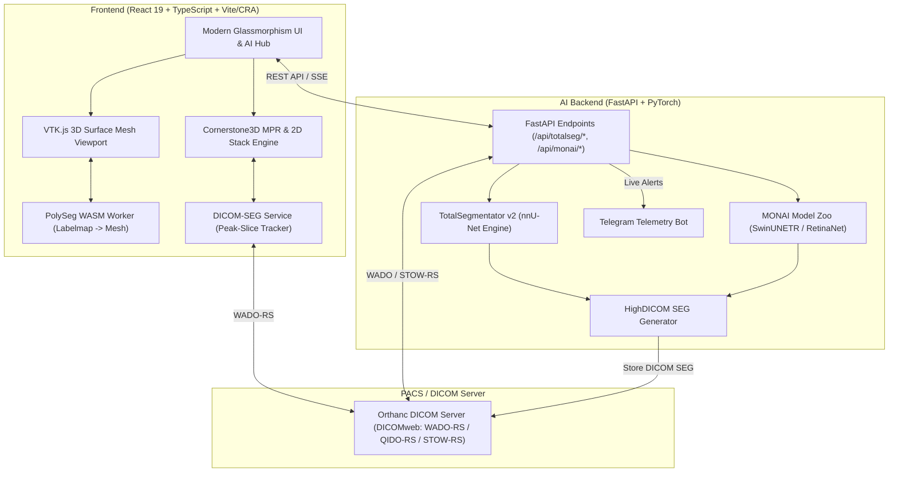

# 🧬 CS3D Viewer — 3D DICOM & Medical AI Workspace

[](https://react.dev/)
[](https://www.typescriptlang.org/)
[](https://www.cornerstonejs.org/)
[](https://kitware.github.io/vtk-js/)
[-red)](https://github.com/wasserth/TotalSegmentator)
[](https://monai.io/)
[](https://fastapi.tiangolo.com/)
[](https://github.com/herrmannlab/highdicom)
[](https://www.orthanc-server.com/)
[](LICENSE)

An enterprise-grade, web-native diagnostic workstation for 2D/3D DICOM visualization, Multi-Planar Reconstruction (MPR), and dual-engine clinical AI analysis. Built with **Cornerstone3D**, **VTK.js**, **TotalSegmentator (nnU-Net v2)**, and **Project MONAI (NVIDIA Clara)**, CS3D Viewer connects seamlessly to PACS via **Orthanc DICOMweb** to deliver instant 3D organ volumetry, nodule detection, and interactive peak-slice navigation.

---

## 🌟 Highlights & Key Features

### 🖥️ Cornerstone3D Multi-Planar Reconstruction (MPR)
- **Synchronized Orthogonal Viewports**: High-performance Axial, Sagittal, and Coronal reconstructions with active crosshair tracking.
- **Synchronized 2D Axial Stack View**: Seamless single-slice scrolling with real-world millimeter coordinate sync.
- **Clinical Presets & Live HUD**: One-click CT presets (Soft Tissue / Abdomen, Bone, Lung, Brain, Mediastinum, Angio) with live telemetry HUD (WW/WC, slice index, zoom level, slice thickness).

### 🤖 Dual-Engine Medical AI Architecture
| Engine | Role | Underlying AI Framework | Capabilities |
| :--- | :--- | :--- | :--- |
| **🧠 TotalSegmentator** | Full Anatomy & Organs | **nnU-Net v2** (3D Fullres U-Net) | 117 whole-body organs, Couinaud liver segments, vertebrae numbering (C1-L5), coronary arteries, dental arch. |
| **🔬 Project MONAI** | Disease & Lesions | **SwinUNETR / 3D RetinaNet** | Anchor-free pulmonary nodules (GGN/Solid), Head CT intracranial hemorrhage (IPH, SDH, EDH, SAH, IVH), airway tree, COVID-19 opacities. |

### 🎯 Instant 2D & 3D Peak-Slice Navigation
- **Peak-Crosshair Centering**: Clicking any segment card in the **🧬 Segments** panel automatically scrolls the 2D Stack and centers all 3 MPR orthogonal viewports directly on the **maximum cross-sectional area** slice of that lesion.
- **Dual Card Controls**: Click the card body to focus/navigate; click the 👁️ eye icon to toggle individual segment visibility and opacity.
- **Reassuring Negative Findings**: Condition-specific AI models display a prominent `🟢 No Acute Pathology Detected` clinical banner when no acute lesions are found.

### 🧊 Interactive 3D Surface Rendering & WASM Meshing
- **VTK.js 3D Viewport**: Real-time rendering of full 3D anatomical structures with camera orbit, pan, zoom, and orientation gizmo.
- **PolySeg WASM Acceleration**: Powered by `@icr/polyseg-wasm` running in dedicated Web Workers for client-side conversion of DICOM SEG labelmaps into 3D surface meshes.
- **STL Export**: One-click export of any segmented organ or lesion to a 3D-printable `.stl` file with real-world millimeter coordinates.

### 🏥 HighDICOM & PACS Interoperability
- **100% DICOM Standard Compliant**: Generates multi-structure DICOM SEG objects using `highdicom` with standardized SNOMED CT clinical codes.
- **Orthanc DICOMweb Roundtrip**: Seamless search (QIDO-RS), image retrieval (WADO-RS), and automated storage (STOW-RS).

### 📲 Real-Time Live Telemetry & Telegram Alerts
- Live bot notifications with rich clinical metadata (Patient ID/Name, Modality, Body Part Examined, Duration, and Findings summary) sent upon AI inference completion.

---

## 🏗️ Architecture



---

## 🛠️ Tech Stack

| Layer | Technologies |
| :--- | :--- |
| **Frontend Framework** | React 19, TypeScript, React App Rewired / Vite |
| **Medical Imaging (2D/MPR)** | `@cornerstonejs/core`, `@cornerstonejs/tools`, `@cornerstonejs/dicom-image-loader` |
| **3D Rendering & Meshing** | `@kitware/vtk.js`, `@icr/polyseg-wasm` |
| **DICOM Parsing & SEG** | `dcmjs`, `dicom-parser`, `highdicom` |
| **Backend Framework** | FastAPI, Uvicorn, Python 3.12 (`uv` virtual environment) |
| **Anatomical AI Engine** | TotalSegmentator v2, nnU-Net v2, SimpleITK, `pydicom` |
| **Pathology AI Engine** | Project MONAI Core & Model Zoo, PyTorch, SciPy |
| **PACS / DICOM Server** | Orthanc (with DICOMweb plugin) via Docker |

---

## 🚀 Quick Start

### Prerequisites
- [Docker](https://www.docker.com/) & Docker Compose
- [Node.js](https://nodejs.org/) (v18.x or higher) and `npm`
- Python 3.10–3.12 (managed automatically via `uv`)

---

### Step 1: Start the Orthanc PACS Server

Launch the Orthanc PACS server with DICOMweb support via Docker:

```bash
docker compose up -d orthanc
```

* **Orthanc Web UI**: [http://localhost:8042](http://localhost:8042)
* **Orthanc Explorer 2**: [http://localhost:8042/ui/app/index.html](http://localhost:8042/ui/app/index.html)
* **Default Credentials**: Username: `orthanc` | Password: `orthanc`

---

### Step 2: Start the FastAPI AI Backend

The backend launcher automatically configures virtual environments, GPU/CPU drivers, and dependencies:

```bash
# First-time setup (creates virtual environment and installs dependencies)
npm run start:server -- --install

# Subsequent runs
npm run start:server
```

* **FastAPI Swagger API Docs**: [http://localhost:8000/docs](http://localhost:8000/docs)

---

### Step 3: Start the React Frontend

Install dependencies and start the dev server:

```bash
npm install
npm start
```

Open [http://localhost:3000](http://localhost:3000) in your browser.

---

## 🔬 Project MONAI AI Task Catalog

CS3D Viewer includes turnkey deep learning pipelines for clinical pathology detection:

| Category | Task ID | Model Name | Pathology / Target Structures | Modality |
| :--- | :--- | :--- | :--- | :--- |
| **Chest & Lungs** | `lung_nodule_ct_detection` | Pulmonary Nodules (GGN & Solid) | 3D Anchor-free Pure Ground-Glass (GGN), Part-Solid, and Solid nodules ($3\text{mm} - 30\text{mm}$) with physical volumetrics. | CT |
| **Chest & Lungs** | `lung_airways` | Airway Tree & Bronchi | Trachea, main bronchi, lobar bronchi, and segmental bronchial branches. | CT |
| **Chest & Lungs** | `covid19_lesion_ct` | Lung Opacity & Consolidation | Ground-glass opacities (GGO), parenchymal consolidation, and pleural effusion. | CT |
| **Brain & Neuro** | `intracranial_hemorrhage_detection` | Intracranial Hemorrhage (ICH) | Multi-window Head CT segmentation for Intraparenchymal (IPH), Subdural (SDH), Epidural (EDH), Subarachnoid (SAH), and Intraventricular (IVH). | CT (Head) |
| **Abdomen** | `spleen_ct_segmentation` | Spleen 3D UNet | High-resolution 3D volumetric spleen segmentation. | CT |
| **Abdomen** | `pancreas_ct_segmentation` | Pancreas & Ducts | Pancreatic parenchymal boundary and ductal morphology assessment. | CT |
| **Abdomen** | `liver_multiorgan_ct` | Liver & Hepatic Lesions | Whole liver volume alongside focal hepatic lesions and tumors. | CT |

---

## 🧠 TotalSegmentator (nnU-Net) Task Catalog

CS3D Viewer provides built-in UI triggers and recommendations for **49 TotalSegmentator models**:

| Category | Task ID | Model Name | Target Structures | Modality |
| :--- | :--- | :--- | :--- | :--- |
| **Whole Body** | `total` | Whole Body (117 Structures) | Liver, spleen, kidneys, pancreas, GI tract, skeleton, major vessels | CT |
| **Abdomen** | `liver_vessels` | Hepatic Vessels | Portal vein, hepatic veins, inferior vena cava | CT (CE) |
| **Abdomen** | `liver_segments` | Couinaud Liver Segments | Functional hepatic segments I through VIII | CT (CE) |
| **Cardiac** | `heartchambers_highres` | Cardiac Chambers (High-Res) | LV/RV, LA/RA, myocardium, ascending aorta | CT |
| **Cardiac** | `coronary_arteries` | Coronary Arteries (CTA) | LAD, LCx, RCA arterial tree | CT (CTA) |
| **Spine** | `vertebrae_pp` | Individual Vertebrae (C1-L5) | Spine numbering with 24 individual vertebrae | CT |
| **Head & Neck** | `teeth` | Complete Dental Arch | Universal FDI notation for all 32 adult teeth & canals | CT |
| **Head & Neck** | `head_glands_cavities` | Head Glands & Cavities | Parotid/submandibular glands, nasal cavity, orbits | CT |
| **MRI** | `total_mr` | Total MRI (50 Structures) | Multi-organ segmentation specifically trained on MR | MR |

---

## 📖 User Workflow

1. **Select / Upload Study**:
   - Query studies from Orthanc via the **Worklist** tab or import sample CT/MR datasets.
2. **2D & 3D MPR Inspection**:
   - Inspect axial, sagittal, and coronal planes with synced crosshairs and CT window presets.
3. **Execute AI Inference**:
   - Switch to **🔬 MONAI AI** (for Nodules, Hemorrhage, Lesions) or **🧠 TotalSegmentator** (for 117 Organs).
   - Click **`⚡ Inference`** and monitor the live stopwatch overlay.
4. **Interactive Peak-Slice Navigation**:
   - Click any segmented finding card in the **🧬 Segments** panel to instantly jump the 2D/3D viewports to its peak slice.
   - Toggle individual segment visibility with the 👁️ eye button.
5. **Export 3D STL**:
   - Click **STL Export** on any segment to download a 3D-printable mesh.

---

## 📁 Repository Structure

```
cs3d-viewer/
├── backend/                        # FastAPI AI Backend
│   ├── core/                       # App configuration & settings
│   ├── routers/                    # API routes (monai.py, segmentation.py, dataset.py, telegram.py)
│   ├── services/                   # AI services (monai_service.py, segmentator.py, orthanc_client.py)
│   ├── requirements.txt            # Python dependencies
│   └── run_server.sh               # Auto-setup & startup script
├── src/
│   ├── components/                 # React UI components
│   │   ├── viewer/                 # Viewer panels, RightPanel (Segments/AI), MonaiTab, TotalSegmentatorTab
│   │   ├── viewport/               # MPRViewer, CornerstoneViewport, HUD, W/L toolbar
│   │   └── worklist/               # QIDO-RS search table & dataset import widgets
│   ├── constants/                  # monai-tasks.ts, totalsegmentator-tasks.ts, presets
│   ├── hooks/                      # Custom React hooks (useCornerstoneViewport, useMPRSegmentation)
│   ├── pages/                      # WorklistPage & ViewerPage
│   ├── services/                   # dicom-seg-service.ts, monai-service.ts, telegram-service.ts
│   ├── styles/                     # Component stylesheets (segmentation-panel.css, mpr.css)
│   └── utils/                      # mpr-utils.ts (peak-slice 2D/3D navigation)
├── docker-compose.yml              # Orthanc PACS service
├── package.json                    # NPM scripts & dependencies
└── README.md                       # Documentation
```

---

## 📄 License

This project is licensed under the MIT License - see the [LICENSE](LICENSE) file for details.
